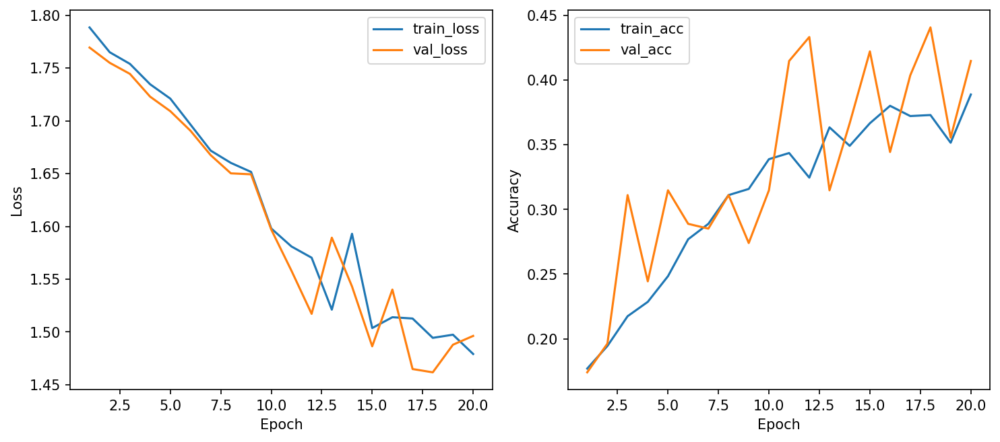

# CSC4005 - Lab 1 Report Template

## 1. Mục tiêu
Huấn luyện một mạng nơ-ron truyền thẳng (MLP) để phân loại 6 loại lỗi trên bề mặt thép từ bộ dữ liệu NEU Surface Defect Database. Theo dõi và đánh giá hiệu năng mô hình qua các siêu tham số khác nhau.

## 2. Cấu hình thí nghiệm
Đã tiến hành chạy 3 cấu hình thử nghiệm khác nhau:
1. **baseline_adamw:** Optimizer AdamW, LR = 0.001, Dropout = 0.3
2. **sgd_test:** Optimizer SGD, LR = 0.01, Dropout = 0.3
3. **adamw_high_lr:** Optimizer AdamW, LR = 0.005, Dropout = 0.5

## 3. Kết quả
| Cấu hình (Run name) | Optimizer | LR | Dropout | Best Val Acc | Test Acc |
|---------------------|-----------|-------|---------|--------------|----------|
| baseline_adamw      | AdamW     | 0.001 | 0.3     | 0.4185       | 0.3815   |
| sgd_test            | SGD       | 0.01  | 0.3     | 0.4407       | 0.4074   |
| adamw_high_lr       | AdamW     | 0.005 | 0.5     | 0.1852       | 0.1889   |

**Learning Curves của mô hình tốt nhất (sgd_test):**

## 4. Phân tích
- **Cấu hình tốt nhất:** `sgd_test` đạt Validation Accuracy cao nhất (0.4407).
- **Dấu hiệu Overfitting / Underfitting:** Mô hình đang bị hiện tượng **Underfitting**. Độ chính xác trên cả tập Train và Valid đều khá thấp (chỉ dao động quanh 40-44%). Nguyên nhân là do kiến trúc mạng MLP thuần túy (chỉ gồm các lớp Linear) không đủ độ phức tạp (capacity) và không trích xuất được đặc trưng không gian tốt như mạng CNN để phân loại các chi tiết phức tạp trên ảnh bề mặt thép.
- **AdamW vs SGD:** Trong thí nghiệm này, SGD với learning rate cao (0.01) cho kết quả nhỉnh hơn AdamW (0.001). Khi tăng Learning Rate của AdamW lên quá cao (0.005) ở cấu hình 3, mô hình không thể hội tụ và bị Early Stopping dừng sớm ở Epoch 6.

## 5. Kết luận
Cấu hình **sgd_test** được chọn là cấu hình tốt nhất vì mang lại độ chính xác cao nhất và đồ thị loss ổn định nhất trong 3 thử nghiệm. 

*Ghi chú về W&B:* Do máy tính bị lỗi chặn policy ngầm định của Windows (WinError 4551), module `wandb-service` không thể đồng bộ dữ liệu lên dashboard. Em xin phép sử dụng bảng số liệu và biểu đồ xuất trực tiếp tại local (`outputs/`) để báo cáo.